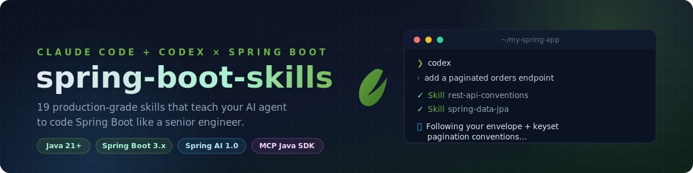
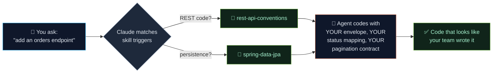

<div align="center">



<br/>
<br/>

**Drop a skill into your project. Your AI coding agent instantly understands your Spring Boot codebase — architecture, patterns, conventions — and codes like a senior engineer who's been on your team for years.**

<br/>

[](skills/)
[](https://spring.io/projects/spring-boot)
[](https://openjdk.org/)
[](LICENSE)

[](https://code.claude.com)
[](https://spring.io/projects/spring-ai)
[](https://github.com/modelcontextprotocol/java-sdk)
[](https://github.com/rrezartprebreza/spring-boot-skills/stargazers)

<br/>

[**Quick Start**](#-quick-start) · [**Skills Catalog**](#-skills) · [**Before / After**](#-before--after) · [**Skill Anatomy**](#-skill-anatomy) · [**Contributing**](#-contributing)

</div>

---

## Why this exists

AI coding agents are great at Python. They hallucinate in Spring Boot.

They generate `@Autowired` field injection instead of constructor injection. They use `ResponseEntity<?>` where you have a standard response wrapper. They ignore your existing exception hierarchy and invent a new one. They don't know your project uses Flyway, so they generate schema SQL by hand. They emit pre-GA Spring AI artifact names that no longer exist in Maven Central.

**Skills fix this.** A skill is a markdown file your agent reads before touching your code. It tells the agent *your* conventions, your stack, your gotchas — not generic Spring Boot from 2020.



This repo is a collection of battle-tested skills. Copy, adapt, drop in.

---

## 🧠 Concepts

| Concept | Description |
|---------|-------------|
| [**Skills**](https://code.claude.com/docs/en/skills) | Markdown files loaded into agent context — tell the agent *how* to work in your codebase |
| [**Subagents**](https://code.claude.com/docs/en/sub-agents) | Isolated Claude instances for parallel work — use for reviews, test generation, migration tasks |
| [**CLAUDE.md**](https://code.claude.com/docs/en/memory) | Project-level persistent memory — your agent's onboarding doc |
| [**MCP Java SDK**](https://github.com/modelcontextprotocol/java-sdk) | Official Java SDK for building MCP servers — connect your Spring Boot app to any AI agent |
| [**Commands**](https://code.claude.com/docs/en/slash-commands) | Slash commands for repeatable workflows — `/generate-endpoint`, `/write-test`, `/db-migrate` |

---

## 📦 Skills

Drop any skill folder into `.claude/skills/` in your project. Claude Code auto-discovers them.

### 🏗️ Architecture

| Skill | Description | Tags |
|-------|-------------|------|
| [**layered-architecture**](skills/layered-architecture/) | Enforces Controller → Service → Repository separation. Prevents business logic leaking into controllers or repositories. | `architecture` |
| [**hexagonal-architecture**](skills/hexagonal-architecture/) | Ports and adapters pattern for Spring Boot. Keeps domain clean of framework dependencies. | `architecture` `ddd` |
| [**domain-driven-design**](skills/domain-driven-design/) | Aggregates, value objects, domain events with commit-safe publication. Includes JPA mapping conventions. | `ddd` `jpa` |
| [**multi-module-maven**](skills/multi-module-maven/) | Parent POM conventions, shared BOM, inter-module dependency rules. Prevents circular deps. | `maven` `architecture` |

### 🔌 API Design

| Skill | Description | Tags |
|-------|-------------|------|
| [**rest-api-conventions**](skills/rest-api-conventions/) | Your project's response envelope, error codes, pagination contract, versioning strategy. Fill in the template. | `rest` `api` |
| [**openapi-first**](skills/openapi-first/) | Generate controllers and DTOs from OpenAPI spec. Uses `openapi-generator-maven-plugin`. | `openapi` `codegen` |
| [**problem-details-rfc9457**](skills/problem-details-rfc9457/) | RFC 9457 compliant error responses with Spring's `ProblemDetail`. Replaces ad-hoc error envelopes. | `error-handling` `rest` |
| [**hateoas**](skills/hateoas/) | Spring HATEOAS link building conventions. Teaches agent when and how to add hypermedia links. | `hateoas` `rest` |

### 🗄️ Data & Persistence

| Skill | Description | Tags |
|-------|-------------|------|
| [**spring-data-jpa**](skills/spring-data-jpa/) | Entity conventions, N+1 prevention, projections, keyset pagination, batch inserts. | `jpa` `hibernate` |
| [**flyway-migrations**](skills/flyway-migrations/) | Migration naming convention, safe multi-step schema changes, team workflow for concurrent migrations. | `flyway` `migrations` |
| [**spring-data-redis**](skills/spring-data-redis/) | Cache-aside pattern, key naming, TTL strategy, stampede protection, serialization config. | `redis` `caching` |
| [**transactional-patterns**](skills/transactional-patterns/) | `@Transactional` propagation rules, self-invocation pitfall, after-commit side effects, saga pattern. | `transactions` |

### ⚙️ Batch & Jobs

| Skill | Description | Tags |
|-------|-------------|------|
| [**spring-batch**](skills/spring-batch/) | Spring Batch 5 chunk jobs on Boot 3 — builder API (no `JobBuilderFactory`), restartable & idempotent job parameters, reader sort/thread-safety, fault tolerance, chunk transaction boundaries. | `batch` `etl` |

### 🔒 Security

| Skill | Description | Tags |
|-------|-------------|------|
| [**spring-security-jwt**](skills/spring-security-jwt/) | JWT auth filter chain, token rotation, RBAC with method security. Opinionated, production-ready. | `security` `jwt` |
| [**oauth2-resource-server**](skills/oauth2-resource-server/) | OAuth2 resource server config, JWT claim extraction, scope-based authorization. | `security` `oauth2` |

### 🤖 AI & MCP

| Skill | Description | Tags |
|-------|-------------|------|
| [**spring-ai-integration**](skills/spring-ai-integration/) | Spring AI 1.0 GA ChatClient, chat memory, RAG pipeline, structured output. GA artifact names — no dead pre-1.0 coordinates. | `spring-ai` `llm` |
| [**mcp-server**](skills/mcp-server/) | Build MCP servers with the official Java SDK 1.0 + Spring AI starters. Tool registration, transports, stdio pitfalls. | `mcp` `ai-agents` |
| [**ai-observability**](skills/ai-observability/) | Token usage tracking, latency monitoring, prompt/response logging for Spring AI apps. | `observability` `spring-ai` |

### 🧪 Testing

| Skill | Description | Tags |
|-------|-------------|------|
| [**testing-pyramid**](skills/testing-pyramid/) | Unit → Slice → Integration conventions. `@WebMvcTest`, `@DataJpaTest`, `@MockitoBean`, Testcontainers. | `testing` |

---

## ⚡ Quick Start

**1. Install Claude Code** (if not already)
```bash
npm install -g @anthropic-ai/claude-code
```

**2. Drop a skill into your project**
```bash
mkdir -p .claude/skills
cp -r spring-boot-skills/skills/rest-api-conventions .claude/skills/
cp -r spring-boot-skills/skills/spring-data-jpa .claude/skills/
```

**3. Tell Claude what you want**
```
claude
> Generate a CRUD endpoint for the Order entity following our REST conventions
```

That's it. Claude reads the skill before writing a single line.

---

## ⚔️ Before / After

The value of these skills is not generic Spring Boot advice. The value is preventing the small mistakes AI agents make when they do not know your backend conventions.

<table>
<tr>
<th>❌ Without a skill</th>
<th>✅ With <code>layered-architecture</code> + <code>rest-api-conventions</code></th>
</tr>
<tr>
<td>

```java
@RestController
public class OrderController {
    @Autowired
    private OrderRepository repository;

    @PostMapping("/orders")
    public ResponseEntity<?> create(
            @RequestBody Order order) {
        return ResponseEntity.ok(
            repository.save(order));
    }
}
```

</td>
<td>

```java
@RestController
@RequestMapping("/api/v1/orders")
@RequiredArgsConstructor
class OrderController {
    private final OrderService orderService;

    @PostMapping
    ResponseEntity<ApiResponse<OrderResponse>> create(
            @Valid @RequestBody CreateOrderRequest request) {
        OrderResponse response = orderService.create(request);
        return ResponseEntity.status(HttpStatus.CREATED)
            .body(ApiResponse.ok(response));
    }
}
```

</td>
</tr>
<tr>
<td>

- Business logic leaks into the controller
- No request DTO or validation boundary
- Repository called directly from the web layer
- Response shape ignores project conventions
- Status codes left to framework defaults

</td>
<td>

- Controller as a pure HTTP adapter
- Service owns the business rules
- DTO validation at the boundary
- Consistent response envelope
- Correct `201 Created` semantics

</td>
</tr>
</table>

---

## 📐 Skill Anatomy

Every skill in this repo follows the same structure:

```
skills/rest-api-conventions/
├── SKILL.md          ← the skill: trigger description + conventions + gotchas
├── examples/         ← good and bad examples, side by side
│   ├── good-controller.java
│   └── bad-controller.java
└── templates/        ← copy-paste starting points
    ├── ApiResponse.java
    └── GlobalExceptionHandler.java
```

**SKILL.md** has two critical parts:

```markdown
---
name: rest-api-conventions
description: >
  Use when generating REST controllers, response objects, DTOs, or error handlers.
  Defines the project's response envelope, HTTP status mapping, and error code conventions.
---

## Conventions
...
```

The `description` is a **trigger** — write it as "use when [condition]", not as a summary. This is what makes the agent actually load the skill.

The **Gotchas** section at the bottom of each skill is the secret weapon: a running list of the exact mistakes agents make in that domain, phrased as `Agent does X — do Y instead`.

---

## 💡 Tips from the trenches

**The Gotchas section is the most valuable part** — add to it every time the agent does something wrong. Your future self will thank you.

**Don't describe what Spring Boot already knows.** Skills should push Claude *out of* its default behavior, not repeat the docs.

**Be opinionated about your project.** Generic Spring Boot best practices belong in a blog post. Skills belong in your `.claude/` folder.

**Fork this repo and customize.** Every team's conventions are different. These are starting points, not gospel.

**Combine with CLAUDE.md.** CLAUDE.md is for project-level memory (build commands, test runner, key architecture decisions). Skills are for domain-specific coding patterns.

| Anti-pattern | Fix |
|--------------|-----|
| Giant SKILL.md with everything | Split into focused skills, one concern each |
| "Always use constructor injection" | Already Claude's default — skip it |
| No examples | Add a `good.java` and `bad.java` — the contrast is what teaches |
| Prescriptive step-by-step instructions | Give goals and constraints, let agent decide how |
| Never updating | Add a Gotchas section, update it when agent fails |

---

## 🔥 Hot: MCP Server Skill

The [`mcp-server`](skills/mcp-server/) skill is the most powerful one here.

It teaches your agent to build production-ready MCP servers on **MCP Java SDK 1.0** and the **Spring AI GA starters** — the same protocol used by Claude, Cursor, VS Code, and every major AI coding tool.

```java
// What the agent generates with the skill loaded —
// real GA API: spring-ai-starter-mcp-server + annotation scanning
@Component
public class OrderMcpTools {

    private final OrderService orderService;

    @McpTool(name = "get_order",
             description = "Get a single order by ID including all line items and status history")
    public OrderResponse getOrder(
            @McpToolParam(description = "UUID of the order", required = true) String orderId) {
        return OrderResponse.from(orderService.findById(UUID.fromString(orderId)));
    }
}
```

Without the skill, the agent guesses: dead pre-GA artifact names, SDK `0.9.0` APIs, `System.out` logging that corrupts the stdio transport — or it gives up and writes Python.

---

## 🗺️ Roadmap

- [x] Skills for Spring Batch
- [ ] Skills for Spring Cloud Gateway
- [ ] Skills for Spring WebFlux / reactive patterns
- [ ] Skills for multi-tenancy
- [ ] CLAUDE.md template for Spring Boot projects
- [ ] `/generate-endpoint` command
- [ ] `/write-test` command
- [ ] `/db-migrate` command
- [ ] Integration with [Hatch](https://github.com/rrezartprebreza/hatch) background job library
- [ ] Integration with [SpringPulse](https://github.com/rrezartprebreza/springpulse) observability

---

## 🤝 Contributing

Skills get better with real-world use. If you find a gap — the agent did something stupid in your Spring Boot project — open a PR and add it to the Gotchas section of the relevant skill.

```
1. Fork the repo
2. Copy an existing skill as a template
3. Fill in conventions, examples, gotchas
4. PR with a one-line description of what problem it solves
```

---

## 🛠️ More from the same workbench

| Repo | Description |
|------|-------------|
| [**Hatch**](https://github.com/rrezartprebreza/hatch) | Multi-module background job library for Spring Boot — REST polling, retry, Redis/JDBC backends, SSE dashboard |
| [**SpringPulse**](https://github.com/rrezartprebreza/springpulse) | Runtime observability for `@Scheduled` methods — AOP interception, WebSocket dashboard |
| [**rest-api-generator**](https://github.com/rrezartprebreza/rest-api-generator) | CLI that scaffolds Spring Boot REST APIs from plain English prompts |

---

<div align="center">

**If a skill saved your agent from writing `@Autowired` field injection today — ⭐ star the repo.**

<br/>

`spring-boot` · `java` · `claude-code` · `mcp` · `spring-ai` · `skills` · `developer-tools`

<br/>

*Built by [@rrezartprebreza](https://github.com/rrezartprebreza) · Pristina, Kosovo*

</div>
